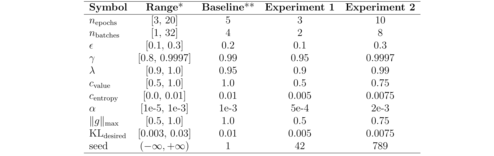

# Hyperparameter Study for Quadruped Robot Locomotion using Reinforcement Learning

This repository contains the research and work conducted as part of my Robotics Master's Thesis. The project builds upon the ViNL implementation [[1]](#1), which enhances the Legged Gym framework [[2]](#2) for obstacle avoidance in indoor environments using the Aliengo Unitree robot.

Our work focuses on two main contributions:
1. **Hyperparameter Study**: A comprehensive analysis of hyperparameters critical for optimizing quadruped robot locomotion.
2. **New Framework Proposal**: A custom-designed framework for the deployment and validation of legged locomotion

We hope this repository will benefit the robotics community by:
- Providing insights into optimized hyperparameters for Legged Gym, leading to better training outcomes.
- Offering a starting point for other researchers or groups, especially those with limited resources, to explore and experiment with quadruped robot locomotion.

## Content
- [Hyperparameter Study for Quadruped Robot Locomotion using Reinforcement Learning](#hyperparameter-study-for-quadruped-robot-locomotion-using-reinforcement-learning)
  - [Content](#content)
  - [Hyperparameter Study](#hyperparameter-study)
    - [1. Baseline](#1-baseline)
    - [2. Optimization](#2-optimization)
    - [3. Results](#3-results)
  - [Proposed Framework](#proposed-framework)
  - [Acknowledgments](#acknowledgments)
  - [References](#references)

## Hyperparameter Study
### 1. Baseline

### 2. Optimization
We have replicated the first two training stages:
1) A **general purpose locomotion** policy which is trained in a rough terrain identical to the one used in [[2]](#2).
2) An **obstacles avoidance locomotion** policy refined from the previous in a flat but cluttered environment.

Then we have conducted an hyperparameter study. The baseline

### 3. Results

## Proposed Framework

## Acknowledgments

## References

<a id="1">[1]</a> 
**Kareer, S., Yokoyama, N., Batra, D., Ha, S., & Truong, J. (2023).**  *ViNL: Visual navigation and locomotion over obstacles.*  arXiv preprint arXiv:2210.14791.  Available at [https://arxiv.org/abs/2210.14791](https://arxiv.org/abs/2210.14791)

<a id="2">[2]</a> 
**Rudin, N., Hoeller, D., Reist, P., & Hutter, M. (2022).**  *Learning to walk in minutes using massively parallel deep reinforcement learning.*  arXiv preprint arXiv:2109.11978. 
Available at [https://arxiv.org/abs/2109.11978](https://arxiv.org/abs/2109.11978)
