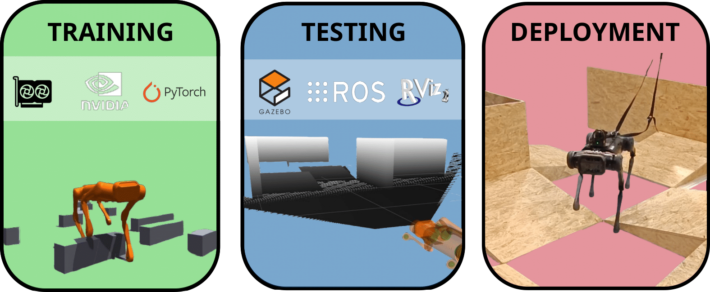
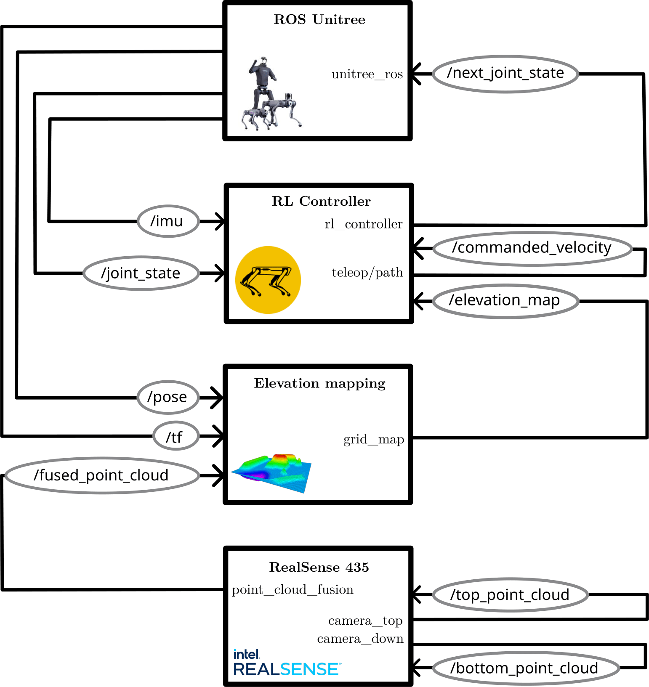
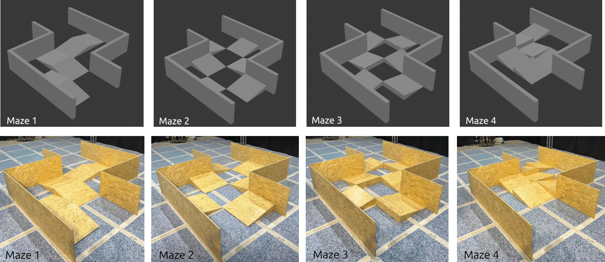
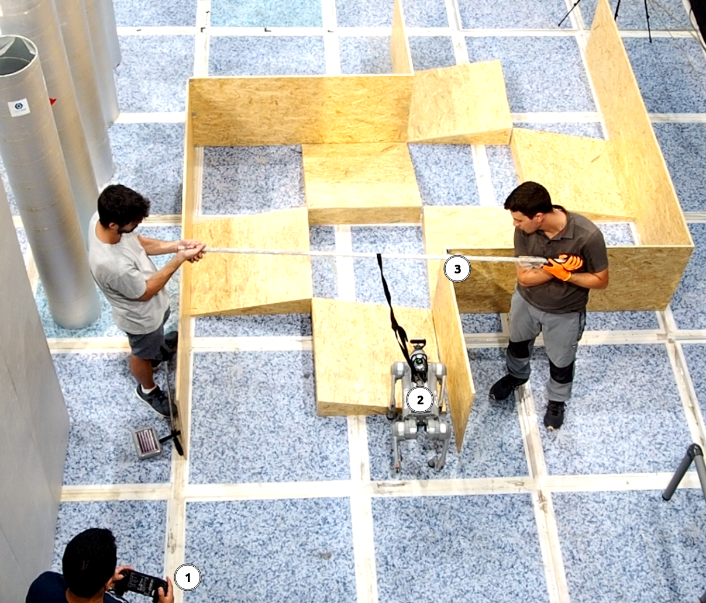

# Hyperparameter Study for Quadruped Robot Locomotion using Reinforcement Learning

This repository contains the research and work conducted as part of my Robotics Master's Thesis. The project builds upon the ViNL implementation [[1]](#1), which enhances the Legged Gym framework [[2]](#2) for obstacle avoidance in indoor environments using the Aliengo Unitree robot.

Our work focuses on two main contributions:
1. **Hyperparameter Study**: A comprehensive analysis of hyperparameters critical for optimizing quadruped robot locomotion.
2. **New Framework Proposal**: A custom-designed framework for the deployment and validation of legged locomotion

We hope this repository will benefit the robotics community by:
- Providing insights into optimized hyperparameters for Legged Gym, leading to better training outcomes.
- Offering a starting point for other researchers or groups, especially those with limited resources, to explore and experiment with quadruped robot locomotion.


## Content
- [Hyperparameter Study for Quadruped Robot Locomotion using Reinforcement Learning](#hyperparameter-study-for-quadruped-robot-locomotion-using-reinforcement-learning)
  - [Content](#content)
  - [Hyperparameter Study](#hyperparameter-study)
    - [Installation](#installation)
    - [Procedure](#procedure)
    - [Results](#results)
      - [1. Baseline](#1-baseline)
      - [2. Optimization](#2-optimization)
      - [3. Conclusions](#3-conclusions)
  - [Proposed Framework](#proposed-framework)
  - [Acknowledgments](#acknowledgments)
  - [References](#references)

## Hyperparameter Study

### Installation

To replicate this research or conduct similar hyperparameter studies, follow these steps:

1) Visit the [ViNL GitHub repository](https://github.com/SimarKareer/ViNL/tree/master) and follow the installation instructions. Alternatively, if you only wish to train a general-purpose locomotion policy, you can directly install the [Legged Gym repository](https://github.com/leggedrobotics/legged_gym).
    > Note: There may be small bugs or customization tips for both ViNL and Legged Gym. Some details are summarized in the `ViNL_customization.md` file in the `src` folder.
   
2) Verify your installation by ensuring you can start trainings.

3) Clone this repository and copy the `my_train.sh` file into the main directory.

4) Create a new folder called `experiments`.

5) Copy the `experiments_generator.py` and `reward_plotting.ipynb` files into the `experiments` folder.

### Procedure

1) Use the `experiments_generator.py` to define the hyperparameters you want to modify. There are two dictionaries in the code:
   - `algorithm_hyperparameters`: defines the baseline values.
   - `hyperparameter_values`: contains vectors with three values for each hyperparameter, e.g., `[new_value, baseline_value, new_value]`.

   For example, if you have 11 hyperparameters and define two new values for each, running this script will create a `my_next_experiments` folder with 22 new files. Each file will be a modified copy of the original `legged_robot_config.py` (located at `pathto/ViNL/legged_gym/envs/base`), with one hyperparameter changed. The file name will correspond to the specific hyperparameter.

2) Run the `my_train.sh` script. You can edit this file to adjust the number of iterations and repetitions.

3) To visualize the results, use the provided code in the `reward_plotting` Jupyter notebooks.

As a result, you should finish with the next folder structure:
```
  pathto/ViNL/
  |- legged_gym/
  |- licenses/
  |- logs/
  |- resources/
  |- scripts/
  |- submodules/
  |- experiments/                   <-- (1)
      |- experiments_generator.py   <-- (2)
      |- reward_plotting.ipynb      <--
  |- my_train.sh                    <-- (3)
  |- ...
```
Arrows point to new files and folders to be added. It has been numbered in order: first create the folder experiments, then copy the two files into it, run the experiment generator and finally from the parent folder run the shell script.

### Results
Main outcomes about this study are summarized below:
#### 1. Baseline
We have replicated the `ViNL` first two training stages:
1) A **general purpose locomotion** policy which is trained in a rough terrain identical to the one used in [[2]](#2).
2) An **obstacles avoidance locomotion** policy refined from the previous in a flat environment with many small obstacles.

The graph illustrates the average reward per episode across various stages. Each simulation was run 10 times, with a total of 5000 episodes per stage. The light blue shaded area represents the range of rewards, while the dark blue line shows the mean rewards. The black line indicates the moving average, and the overall mean is highlighted in red. Additionally, the peak mean reward is also marked.

To assess the convergence of the initial training phase, the simulation was extended to 10000 episodes. Next figure presents the results without reruns, where the light blue range is absent, and the blue line reflects the reward from a single simulation.

The first training phase converged after 6000 episodes, while the second phase reached maximum reward within 1000 episodes. Additional iterations led to overfitting, making 6000-6500 episodes sufficient for phase one and 1000-1500 for phase two.

#### 2. Optimization

We then carried out a hyperparameter study, summarized in the table below. For each set of base hyperparameters, we conducted two experiments, totaling 22 simulations. The goal was to thoroughly explore the entire hyperparameter range while paying particular attention to the values near the baseline settings.


*PPO hyperparameters ranges were obtained from [[3]](#3). **Baseline values come from [[4]](#4).

For the sake of clarity, not all the graphs from each simulation are included here; they can be found in the [attached report](./TFM_Josep_Barbera.pdf). However, the two graphs where the newly studied hyperparameters led to higher rewards are included.


The following table presents the results of the study. Simulations that improved upon the baseline are highlighted in green, with only those showing significant improvement in bold.


#### 3. Conclusions
After confirming that $\gamma=0.95$ and $c_{\text{entropy}}=0.005$ yielded the best results during training, a final simulation was conducted using these two new parameters and compared to the baseline. The results were satisfactory, as shown in the following figure.


## Proposed Framework
To tackle the problem of quadruped locomotion, the following framework is proposed, consisting of three consecutive stages: training, testing and deployment.

- **Training** involves developing a locomotion policy using reinforcement learning algorithms like PPO in simulation platforms such as Isaac Gym. This stage also includes techniques like teacher-student distillation and sim-to-real transfer strategies.

- **Testing** focuses on evaluating these policies in simulated environments, such as those provided by ROS. It includes testing sensory fusion, robot models, new simulated environments in Gazebo, control architecture, loop closure speeds, and signal matching.

- **Deployment** covers the design and setup of real-world test environments, executing the simulated ROS architecture on physical robots, as well as data collection and performance evaluation.



The **training** process has already been explained. Below are the results for the most successful and visually appealing behavior achieved during training for both training stages.

| General Purpose Locomotion | Obstacles Avoidance Locomotion |
|---------|---------|
|  |  |

For the **testing** phase, we propose the following ROS architecture:

The main components for this architecture can be found in the `src/unitree_ws` directory. More detailed information is available in the [master thesis](./TFM_Josep_Barbera.pdf).

For the **deployment** phase, we designed and constructed a modular test circuit to validate the locomotion policy. As an initial step, we established the baseline behavior of the Central Gait Pattern Generator (CGPG) that comes pre-configured with Unitree robots. This baseline serves as a qualitative reference for the robot’s performance in navigating the circuit and overcoming obstacles.

Given the modular design of the circuit, four different configurations were tested (see the figure below). These layouts were also reproduced in Gazebo to better compare performance between the testing and deployment stages.


The experimental setup is depicted in the following figure:


The next table presents short videos of the robot's navigation through each of the circuits

| Init       | Top       | End       |
|----------------|----------------|----------------|
|                |  |  |
|                |  |  |
|                |  |  |
|     |  |  |
|             |  |  |
|    |  |  |


Circuits 1 and 2 are the easiest, requiring only a simple gait pattern, while Circuit 3 is the most challenging. The normal gait mode fails to overcome obstacles, and the stair-climbing mode struggles with descending them. Circuit 4 presents medium difficulty, successfully navigated via teleoperation.

Quantitative metrics for these tests are difficult to obtain due to the complexities of teleoperating delicate hardware, making traditional measures like path error or time unreliable. More rigorous quantification, especially of the Central Gait Pattern Generator, is needed.

The current gait patterns are fragile, requiring constant supervision. Improved controllers, like MPC or RL-based systems, are needed to enhance performance, especially in complex circuits. The Go2 robot was excluded from further testing due to its instability.

## Acknowledgments


## References

<a id="1">[1]</a> 
**Kareer, S., Yokoyama, N., Batra, D., Ha, S., & Truong, J. (2023).**  *ViNL: Visual navigation and locomotion over obstacles.*  arXiv preprint arXiv:2210.14791.  Available at [https://arxiv.org/abs/2210.14791](https://arxiv.org/abs/2210.14791)

<a id="2">[2]</a> 
**Rudin, N., Hoeller, D., Reist, P., & Hutter, M. (2022).**  *Learning to walk in minutes using massively parallel deep reinforcement learning.*  arXiv preprint arXiv:2109.11978. 
Available at [https://arxiv.org/abs/2109.11978](https://arxiv.org/abs/2109.11978)

<a id="3">[3]</a>
**Legged Robotics**. (2024). *Legged gym: Legged robot configurations*. GitHub repository. Accessed: 2024-08-27. Available at https://github.com/leggedrobotics/legged_gym/blob/17847702f90d8227cd31cce9c920aa53a739a09a/legged_gym/envs/base/legged_robot_config.py#L215

<a id="4">[4]</a>
**AurelianTactics**. (2018). *PPO hyperparameters and ranges*. Medium. Available at https://docs.google.com/spreadsheets/d/1fNVfqgAifDWnTq-4izPPW_CVAUu9FXl3dWkqWIXz04o/edit?usp=sharing